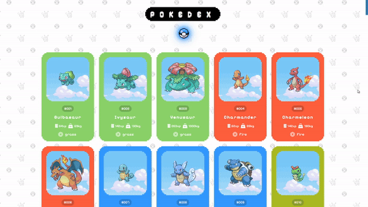

# Pokedex

  

  <a href="https://pokedex-io.netlify.app/">Web Sitesi</a>

 Sitemizde, Pokémonların detaylı bilgilerini bulabilirsiniz. Her Pokémon'un kendine özgü ID'si, gücü, kilosu ve elementi bulunmaktadır. Ayrıca, Pokémonlar elementlerine göre renklendirilmiştir. Site tasarımında sade piksel ve Pokémon teması tercih edilmiştir.

## Özellikler

- **Pokémon Bilgileri:** Her Pokémon'un ID'si, gücü, kilosu ve elementi gibi bilgileri.
- **Element Renkleri:** Pokémonlar, elementlerine göre renklendirilmiştir.
- **Sade Piksel Teması:** Site tasarımı sade ve piksel teması ile yapılmıştır.
- **Hızlı Arama:** Arama kısmından Pokémon adını yazarak hızlıca erişebilirsiniz.
- **Responsive Tasarım:** Site, tüm cihazlarda (masaüstü, tablet, mobil) mükemmel görünecek şekilde responsive olarak tasarlanmıştır.

## Ekran Görüntüleri

